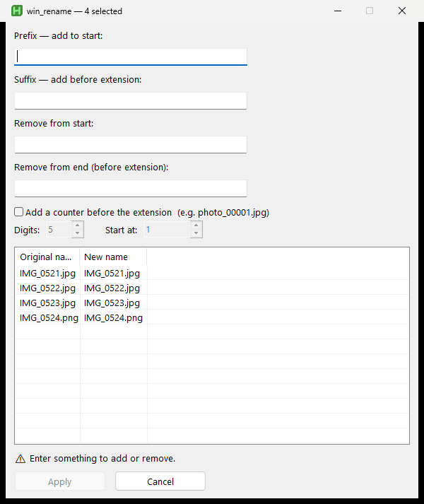
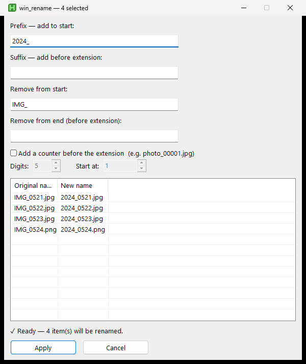

<div align="center">

# 🏷️ win_rename

### Batch-add a prefix/suffix to your files — right inside Windows Explorer.

**Select files → hit <kbd>Alt</kbd>+<kbd>F2</kbd> → type → done.**
No cloud. No telemetry. No 200 MB installer. Just one tiny tray app. 🪶

<p>
  <a href="https://github.com/surrealier/Windows_Renamer/releases/latest/download/win_rename.exe">
    
  </a>
</p>

<p>
  
  
  
  
  
</p>

<!-- 👉 Drop your hero GIF here. Suggested path: docs/demo.gif (record selecting files → Alt+F2 → typing → Apply) -->


</div>

---

## 😩 The problem

You pick 10 files in Explorer, press <kbd>F2</kbd> to rename them all at once... and Windows names them **all the same** with a counter:

```
사진 (1).jpg   사진 (2).jpg   사진 (3).jpg   😭
```

But you didn't want that. You just wanted to slap `2024_` on the front. That's it.

## ✨ The fix

**win_rename** keeps every original filename and just adds your **prefix** and/or **suffix** — with a live preview before anything touches the disk.

```
report.pdf   →   2024_report_final.pdf      (prefix "2024_",  suffix "_final")
data.xlsx    →   2024_data_final.xlsx
photo.jpg    →   2024_photo_final.jpg
```

> The **suffix goes before the extension**, so `.pdf` / `.jpg` stay intact. 👌

---

## 🚀 Quick Start

> **TL;DR — download the exe, double-click, press `Alt`+`F2` in Explorer.**

### ⚡ Option A — Download & run · *Recommended*

#### **1.** ⬇️ Just Install! **[`win_rename.exe`](https://github.com/surrealier/Windows_Renamer/releases/latest/download/win_rename.exe)**
#### **2.** Just Execute!
#### **3.** In Explorer, **select files** → **`Alt`+`F2`**
#### **4.** Type a **prefix / suffix** → **Apply**

*No AutoHotkey. No setup. Nothing to clone.*

### 🧩 Option B — Run the script

Prefer the raw `.ahk`? You just need AutoHotkey v2 — a normal program installed **once, system-wide (not per-folder, not inside the repo)**:

#### **1.** `winget install AutoHotkey.AutoHotkey`  *(run anywhere, one time)*
#### **2.** Double-click **`win_rename.ahk`**
#### **3.** Same as above → **select files → `Alt`+`F2` → type → Apply** ✅

<div align="center">
  <!-- 👉 Drop a screenshot of the dialog here. Suggested path: docs/dialog.png -->
  
</div>

---

## 🧠 Features

- 🏷️ **Prefix + suffix in one shot** — suffix lands *before* the extension
- 🔢 **Auto-increment counter** — append `00001`, `00002`, … before the extension; set the zero-padding & start number with the ▲▼ spinners
- 👀 **Live preview** — see `old → new` for every file as you type
- 🛡️ **Safe by default** — blocks illegal characters, never overwrites existing files, isolates per-file failures
- 🪟 **Windows 11 tab-aware** — reads the selection from the *active* Explorer tab, not a random one
- 🗂️ **Files *and* folders**
- ⌨️ **Context-smart hotkey** — `Alt+F2` only fires in Explorer/Desktop; everywhere else the key behaves normally
- 🪶 **Featherweight** — a single tray app, no background bloat

---

## built-in `F2` vs Renamer `Alt+F2` 

| | built-in `F2` | **Renamer `Alt+F2`** |
|---|---|---|
| Keep original names | ❌ all become the same | ✅ |
| Add prefix | ❌ | ✅ |
| Add suffix (before extension) | ❌ | ✅ |
| Live preview | ❌ | ✅ |
| Folders too | ⚠️ | ✅ |

---

<details>
<summary>⚙️ <b>How it works</b> (for the curious)</summary>

<br>

| Step | Mechanism |
|------|-----------|
| Hotkey scope | `GroupAdd` (CabinetWClass / WorkerW / Progman) + `#HotIf WinActive("ahk_group …")` — stays on the optimizer fast path |
| Read selection | enumerate `Shell.Application.Windows` → match the active window's HWND → on Win11, resolve the **active tab** via `ShellTabWindowClass1` + `IShellBrowser::GetWindow` → `Document.SelectedItems().Path` |
| Name transform | `SplitPath` → `prefix + nameNoExt + suffix + "." + ext` |
| Rename | file `FileMove(…, 0)` / folder `DirMove(…, "R")`, each wrapped in try/catch |

Case-only renames (`a.txt → A.txt`) and cyclic swaps are handled via temporary names.

</details>

<details>
<summary>📦 <b>Build the .exe yourself</b> (optional — a prebuilt one is in <a href="https://github.com/surrealier/Windows_Renamer/releases">Releases</a>)</summary>

<br>

```powershell
& "<path-to>\Ahk2Exe.exe" `
  /in  "win_rename.ahk" `
  /out "win_rename.exe" `
  /base "C:\Program Files\AutoHotkey\v2\AutoHotkey64.exe"
```

> `/base` **must** point at a **v2** base file.

</details>

<details>
<summary>⚠️ <b>Notes & gotchas</b></summary>

<br>

- **Don't run as admin.** If the app is elevated while Explorer isn't (the normal case), Windows hides the selection from it and you'll get an empty list. Renames in protected folders (Program Files, Windows, …) show up as per-file *"Access Denied"*.
- **Dotfiles** (`.gitignore`) are treated as extension-only, so affixes are prepended: `2024__final.gitignore`. The preview shows exactly what will happen.
- **Laptop F-row** in media mode? Use `Fn`+`Alt`+`F2`, or flip the firmware (BIOS) function-key setting.
- **SmartScreen** may warn on the unsigned `.exe` the first time → *More info → Run anyway* (or use Option B).

</details>

<details>
<summary>🧪 <b>Tests</b></summary>

<br>

`test_win_rename.ahk` ships 41 automated tests (name transform, validation, counter, on-disk rename engine, collisions, partial-failure isolation):

```powershell
& "$env:LOCALAPPDATA\Programs\AutoHotkey\v2\AutoHotkey64.exe" test_win_rename.ahk
# report → %TEMP%\win_rename_test_result.txt
```

</details>

---

## ▶️ Start with Windows

The **`.exe` auto-registers on its first run**, so it starts with Windows out of the box. Toggle it any time from the tray icon → **Add / Remove from Startup** (your choice is remembered).

---

## 🤝 Contributing

Issues and PRs welcome! Ideas: find & replace, case conversion, regex mode, drag-to-reorder.

## ⭐ Like it?

If win_rename saved you from a rename rage-quit, drop a star — it genuinely helps. 🙌

## 📄 License

[MIT](LICENSE) — do whatever, just keep the notice.
